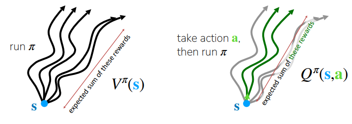
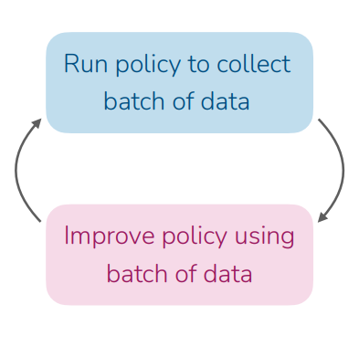
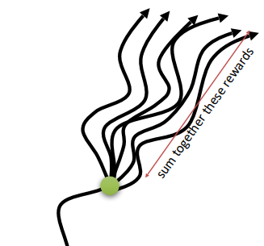

+++
date = '2026-01-24T11:59:40+01:00'
draft = false
title = 'Actor Critic Methods in Deep RL'
+++

#### The RL problem

In reinforcement learning, the purpose of the agent is to learn by interacting with its environment. A policy defines the agent’s way of behaving at a given time. Policy is the agents behavior function, denoted with π, which tells which action to take in a given state. 

At each given time step t, the agent is given a state representation $s_t$, and it outputs an action $a_t$ following the policy π. Mathematically it is described as π ($a_t$|$s_t$).

Following the policy π ($a_t$|$s_t$), the agent receives a scalar reward $r_t$ and it is transitioned to next state $s_{t+1}$. The goal of the agent is to maximize the cummulative rewards it receives in the long run. But how do we define that formally ? Generally we wish to maximize the *expected return* $G_t$, where $G_t$ is defined as the sum of rewards in future time steps.

$G_t$ = $r_{t+1}$ + $r_{t+2}$ + $r_{t+3}$ + ...+ $r_{T}$  
where T is the final time step.

##### Value Function

Value functions tells us how good it is for the agent to be in a particular state (or how good it is to perform in a given state). By *how good*, here we mean in terms of expected return or sum of future rewards $G_t$.  

Value of a state is defined as $v_π(s)$ which denotes the expected return starting from state s and following the policy π. Mathematically it is described as 

$v_π(s)$ = $E_π$[$G_t$ | S=$s_t$] = $E_π$$[\sum_{k=0}^{\infty} \gamma^k R_{t+k+1} | S=s_t]$

$\gamma^k$ denotes the discounting factor $\in$ [0,1] to penalize the future rewards.

$v_π(s)$ is also known as **state-value**, which denotes the value of the given state $s_t$.

We also define **action-value**, which denotes the value of taking action _a_ in a given state _s_ and following the policy $\pi$. It is described as $q_π(s, a)$ 

$q_π(s, a) = E_π[G_t | S=s_t, A=a_t] = E_π[\sum_{k=0}^{\infty} \gamma^k R_{t+k+1} | S=s_t, A=a_t]$

<!--  -->

The difference between $Q_π(s, a)$ and $V_π(s)$ is known as **Advantage function** which tells how much better is to take action _a_ than follow policy $\pi$ in state _s_.

$A_\pi(s) = Q_\pi(s, a) - V_\pi(s)$

#### Online-RL with Policy Gradients

Policy Gradient Methods optimize the policy $\pi_\theta (a | s)$. They adjust the parameters $\theta$ of the model in such a way that the actions leading to higher rewards become more likely. The objective function is _J($\theta$)_ represents the expected return (total reward) of the policy. The goal of policy optimization to maximize expected episodic rewards  _J($\theta$)_.  

$J(\theta) = E_{\pi_\theta} \left[ \sum_{t \in 0:T} \gamma^t R_t | S_0 = s_0 \right]$

where $\gamma$ is the discount factor.

Below steps describes [REINFORCE](https://link.springer.com/article/10.1007/BF00992696) algorithm, which was the first policy gradient method.
 
> 1. Rollout N trajectories in the environment, using $\pi_\theta$ as the policy function
> 2. Compute the policy gradient estimation $\nabla_\theta J(\theta)$
> 3. Update the policy by gradient ascent: $\theta_{i+1}$ <- $ \theta_i + \alpha \nabla_\theta J(\theta)$

The $\nabla_\theta J(\theta)$ is the Policy Log Likelihood which says, "What direction should I move my parameters to make this action more likely?" 
 
$\nabla_\theta J(\theta) \approx 
\frac{1}{N} \sum_{i=1}^{N} 
\sum_{t=1}^{T} 
\nabla_\theta \log \pi_\theta(a_{i,t} \mid s_{i,t}) 
\left( 
\sum_{t'=t}^{T} r(s_{i,t'}, a_{i,t'}) - b 
\right)$

where,   

- $\sum_{i=1}^{N}$ is samples collected from the policy.  

- $\nabla_\theta \log \pi_\theta(a_{i,t} \mid s_{i,t})$ is policy log-likelihood i.e. probability of taking $a_t$ in state $s_t$  

- $\sum_{t'=t}^{T} r(s_{i,t'}, a_{i,t'})$ is defined as _"reward-to-go"_ which is the sum of total rewards starting from time step _t_.  

- _b_ is the baseline which is subtracted from the return to
reduce the variance of gradient estimate.  

##### What is dissatisfying about Policy Gradients ?

Policy gradients are conceptually clean, but suffers from high variance, sample efficiency and unstable learning. 

- **The Wrong Credit Problem:** 
It uses same returns for all actions in a trajectory which makes it hard to know which actions really deserved credit or blame. Imagine a robot takes a step forward at time step $t^4$ and then falls backward at $t^5$. Because the **reward-to-go** was low during that episode, the math pushes down the likelihood of every action in that sequence.  

- **Sparse Rewards Problem:**
Imagine a robot trying to fold a jacket. At time step $t^2$ it folds the sleeves and $t^3$ it flattens the jacket and at $t^4$ it folds the jacket. However if the rewards are sparse (meaning the robot only gets a "1" for a perfectly folded jacket and "0" for everything else), the agent cannot distinguish between which actions are beneficial since it receives the same reward for time step 2 and 3.   

This makes the learning sample-efficient. Policy-gradient alorithms doesn't make efficient use of data. However, can we actually learn _What actions are good or bad?_

#### Improving Policy Gradients 

Remember that in our policy gradient algorithm above, $\sum_{t'=t}^{T} r(s_{i,t'}, a_{i,t'})$ is denoted as _reward-to-go_ which is the estimate of future rewards if we take action $a_t$ in state $s_t$. 

If we just sum up the rewards from one specific trajectory, we are looking at just one possible outcome which might be an outlier, leading to poor estimates of our model. However, can we get a better estimate ?  

Instead of using sum of future rewards, we can use _action-value_ estimate Q$(s_t, a_t)$. Instead of just one random sample, Q$(s_t, a_t)$, represents the expected (average) future rewards if we take action **a** in state **s** and follow our policy thereafter. 

$\nabla_\theta J(\theta) \approx 
\frac{1}{N} \sum_{i=1}^{N} 
\sum_{t=1}^{T} 
\nabla_\theta \log \pi_\theta(a_{i,t} \mid s_{i,t}) 
\left( 
Q(s_t, a_t) - b 
\right)$

**But what about baseline b ?**  
The best baseline to use is the Average Reward of that state,
$b = \frac{1}{N} \sum_{i} Q(s_{i,t}, a_{i,t})$.  

Remember that $V_\pi(s_t)$ is defined as expected value of _Q_ across all possible actions.  
$V(s_t) = E_{a_t \sim \pi_{\theta}(\cdot|s_t)} [Q(s_t, a_t)]$ 

Thus we can replace the above baseline _b_ with Value Function $V_\pi(s_t)$. So now we can write the gradient update as,  

$\nabla_\theta J(\theta) \approx 
\frac{1}{N} \sum_{i=1}^{N} 
\sum_{t=1}^{T} 
\nabla_\theta \log \pi_\theta(a_{i,t} \mid s_{i,t}) 
\left( 
Q(s_t, a_t) - V_\pi(s_t) 
\right)$.  

Remember that, $Q(s_t, a_t) - V_\pi(s_t)$ is defined as Advantage function.  

$\nabla_\theta J(\theta) \approx 
\frac{1}{N} \sum_{i=1}^{N} 
\sum_{t=1}^{T} 
\nabla_\theta \log \pi_\theta(a_{i,t} \mid s_{i,t}) 
A(s_{i, t}, a_{i, t})$. 

Now it would be very logical to have better estimates of Advantage function, since it can assist in much better policy updates. Better estimates of A leads to less noisy gradients which helps in reducing variance during policy update and this is exactly what Actor-Critic does. 

#### Actor Critic 

Actor-Critic are the type of [Temporal-difference (TD)](https://en.wikipedia.org/wiki/Temporal_difference_learning) methods which have a seperate policy and Value function. 

- **Actor:** This is a policy function $\pi_{\theta}(a|s)$ where $\theta$ are the parameters of the actor. The goal is find the parameters $\theta$ that maximizes the expected reward $J_\theta$. 
- **Critic:** It is the estimated value function. It can be either $V_{\pi}(s)$ or $Q_{\pi}(s, a)$. 

Let's assume a case where the state-value function $V_{\phi}(s)$ is used for critic where $\phi$ are the parameters of the critic network. Here's how the vanilla actor-critic algorithm looks like. 

> 1. Sample action a~$\pi_\theta(a|s)$ and get (s, a, s', $r_i$)
> 2. Compute the TD(1) error $\delta_i$ = $r_i + \gamma V_\phi(s') - V_\phi(s_i)$.
> 3. Update the critic parameters $\phi$ <-- $\phi + \alpha \delta_i \Delta_\phi (V_\phi(s))$
>4. Update the actor parameters $\theta$ <-- $\theta + \beta \delta_i \Delta log _\pi(a|s)$

#### References
1. Policy Gradient Methods, https://en.wikipedia.org/wiki/Policy_gradient_method 
2. Richard S. Sutton and Andrew G. Barto. [Reinforcement Learning: An Introduction; 2nd Edition. 2018](https://web.stanford.edu/class/psych209/Readings/SuttonBartoIPRLBook2ndEd.pdf)
3. lilianweng.github.io, https://lilianweng.github.io/posts/2018-04-08-policy-gradient/
4. Sergey Levine, https://rail.eecs.berkeley.edu/deeprlcourse-fa23/ 